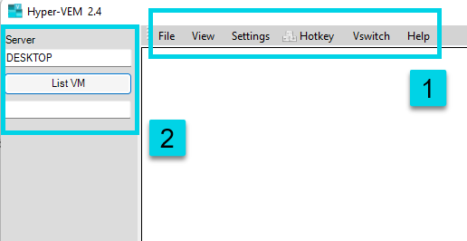
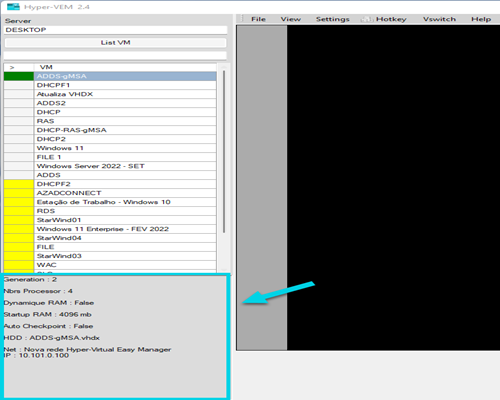
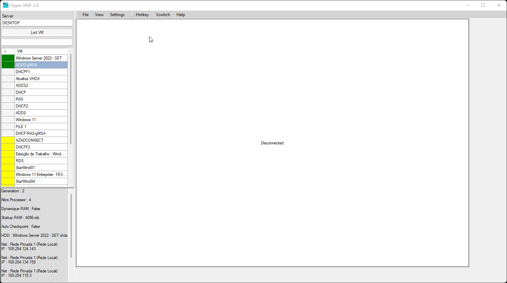
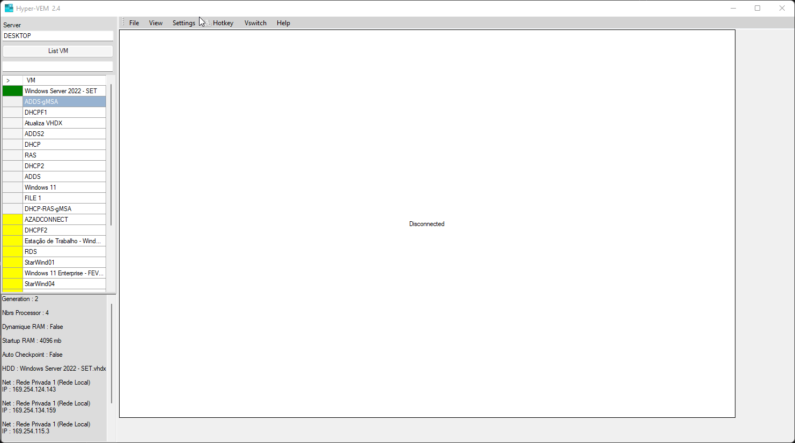
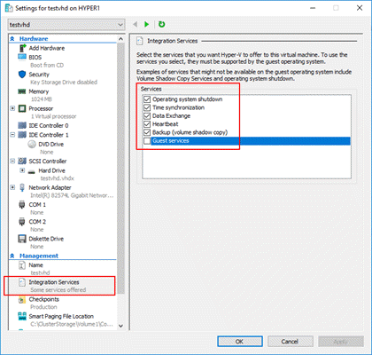

# Help : Hyper-Virtual Easy Manager

Hyper-VEM manages multiple virtual machines and remote server hypervisor server. Very useful for lab hypervisor server where you need regular access to each virtual machine.
  
##### Table of Contents  :
* [1-Interface](#Interface) 
* [2-Manage_Machine](#Manage_Machine)  
* [3-Manage the network](#Manage_network)
* [4-Settings (Language-Copy)](#Settings)
* [5-View Mode](#View_Mod)

 
## 1-Interface
<a name="Interface"/>

Its interface is easy to use. Remember that you must be a member of the Hyper-V Administrators group.

**Text box 1:** Will be activated when the virtual machine (VM) is being accessed.

**Text box 2:** Allows you to access the remote server and list the virtual machines. By default, the name of the current server is displayed.

**Virtual machine information**

You can also view information for a virtual machine, but the virtual machine must be running.

**Let's start**

Once the Hyper-V server you want to access has been defined, click **List VM**. Virtual machines will be listed.

The virtual machines are listed alphabetically and by status, the virtual machines that are running are listed above in green, then the non-colored ones that are in shutdown status and the saved ones in yellow color.

")

  

**Status of virtual machines**

**Green – Running** ** in execution")**

**No color – Turn off** ** without status")**

**Yellow – Save** ** Saved")  

## 2-Manage_Machine
<a name="Manage_Machine"/>

**To access a virtual machine** is very easy, **just double-click on the name of the virtual machine that is already running**. Click on **HotKey**, then enter your **username** and **password**.

")

**To start a virtual machine (VM)** by **right-clicking it**, then clicking **Start-VM**.

")

## 3-Manage the network 
<a name="Manage_network"/>
To **change the network of the virtual machine (VM)**, click **Network**, then select the network you want to **connect** to.

")

If you **add a new switch (network)** click **Vswitch** in the **top menu** to update.

## 4-Settings (Language-Copy)
<a name="Settings"/>

**Languages:** We can change the language between French, English and Brazilian Portuguese, China, Italia, Spanish

**Copy-clipbord****:** Allows you to **copy a text** to the virtual machine (VM).

")

**Copy****\-files:** Allows you to **copy files** to the virtual machine (VM).

") 

PS : * The file is copied by defaut to C:\temp directory
     * You need to enable the "Guest Services" On VM to copy the files (not needeed if copy a text)
     

## 5- View Mode
<a name="View_Mod"/>

By default the **Original Display** is selected, it use the real resolution, you can adjust resolution into the virtual machine (VM), then the resolution change, the original display mode offers a better view. 

 resolution to preview for original display")

**View:** You can use this mode to adjust the virtual machine (VM) view if the resolution is very hight that the screen (example : 1920x1080 on a 1376 screen)
If you want to adjust the resolution of the virtual machine (VM) for a more **comfortable view**, click **View**, then click **Adjust** **D****isplay**, then **double-click the virtual machine (VM) name to apply the change**.

 resolution for more comfortable viewing") 

“Hyper-Virtual Easy Manager By Dakhama"

Thanks to Gabriel Luiz who prepared this document.

