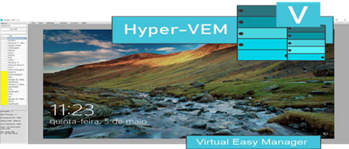

# Hyper-VEM 

Hyper-Virtual Easy Manager to control Hyper-V machine (hyper-VEM)

Hyper-V easy manager is a free software that allow you to manage easy your VM on local or remote server.

# Last version : 
* 2.05 release (05/2022)

# Whats News :
* Add language : spanish, China, Italia
* Add Copy and Paste From ClipBoard
* Add Copy files to VM

## Tables of contents : 

* 
* ")

# Context :

Hyper-v is the best hypervisor in the world, but with the default console it is hard to work well as switch between machines easily, adapt the display, change network cards on one click, without any credentiel, it is for these reasons that we have developed Hyper-Vem in order to make the work pleasant, and help Microsoft communnity with fast and secure solution.

Other Usage methods

You can manage local server hyper-V (in domain or not) also the remote server if you are in the domain, you can too use RDP connection.

no authentication required or password to enter, very secure and use integrated credential with TLS2.

# Requirements :

* Powershell v5+
* Windows server 2012 R2 or more
* Windows 10 1803 or more

# How To use :

* ON LOCAL SERVER : 

IF Hyper-v is installed on your Windows Server or your Windows 10, just install this tool and run it with administrator,
check also if your are member of the Hyper-V administrators group.

* On Remote PC : 

The two computer must be in the domain, or you must resolve the dns name, and on remote PC for exemple you must enable features hyper-V.
be sur that you are member of the Hyper-V administrators group. if not work install the software on your server and run it just on time. you can then connect on your remote server easly.

# How to Work :

after install, run Hyper-VEM as administrator, click list VM, and enjoy.
to connect VM select VM with mouss and wait the connect estabilish in right.
to start VM, select it on list, right click mouss and select start VM, wait a few and VM will be appareid in top of the list.
the VM with green color is current run, without color is shutdown, and yellow color is saved stat.
to change the network select VM, right click select network, the network will be appareid, click the barre appareid and select network to change.
 

# Important: 
to switch with VM display, you must click a first time in the new VM on list one time for disconnect the last VM, and second time to connect. then you must click two time on new VM list to switch beetwen VM.

#Hotkey : 
To simule ALT+CTRL+DELETE = you have a bouton in barre named Hotkey 

Feedback :

this is the first version ,all your suggestions and remarks is welcom, to improve the product and make it more useful, thanks
